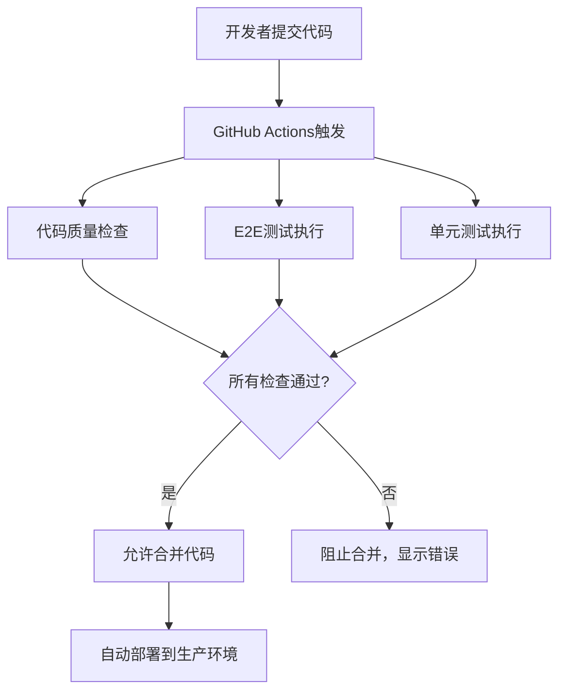

# 🚀 E2E测试CI/CD集成完成总结

## ✅ 已完成的工作

### 1. 创建了两个GitHub Actions工作流文件

#### 📄 `.github/workflows/e2e-tests.yml` (完整版)
- **特性**: 多浏览器测试矩阵 (Chromium, Firefox, WebKit)
- **缓存**: 智能依赖和浏览器缓存机制
- **报告**: 详细测试报告和GitHub Pages集成
- **触发**: PR、Push、手动触发
- **执行时间**: 约15-25分钟

#### 📄 `.github/workflows/e2e-tests-simple.yml` (简化版)
- **特性**: 仅Chromium浏览器，快速执行
- **适用**: 频繁CI检查，轻量级验证
- **触发**: PR、Push
- **执行时间**: 约8-12分钟

### 2. 创建了配套文档和脚本

#### 📚 `docs/ci-cd/e2e-integration-guide.md`
- 详细的使用指南和配置说明
- 故障排除和最佳实践
- 性能优化建议

#### 🔍 `scripts/verify-e2e-ci-integration.js`
- 自动验证工作流配置的正确性
- 检查所有必需文件和配置
- 生成验证报告

### 3. 更新了项目配置

#### 📦 `package.json`
- 添加了新的验证脚本: `test:verify-e2e-ci`

## 🎯 核心功能特性

### 自动化触发条件
```yaml
# Pull Request到main或develop分支
pull_request:
  branches: [main, develop]

# 推送到main分支  
push:
  branches: [main]

# 手动触发 (仅完整版)
workflow_dispatch:
```

### 关键执行步骤
1. ✅ 检出代码
2. ✅ 设置Node.js 20和pnpm 8环境
3. ✅ 安装项目依赖 (带缓存优化)
4. ✅ 安装Playwright浏览器 (带缓存优化)
5. ✅ 运行E2E测试 (`pnpm test:e2e`)
6. ✅ 上传测试报告和失败截图

### 质量保障机制
- **失败阻断**: E2E测试失败时整个CI流程失败
- **重试机制**: CI环境自动重试2次
- **超时控制**: 工作流和测试都有合理超时设置
- **报告生成**: HTML、JSON、JUnit多格式报告

## 🚦 使用方法

### 立即验证配置
```bash
# 验证E2E CI/CD集成配置
pnpm test:verify-e2e-ci
```

### 本地测试E2E
```bash
# 运行所有E2E测试
pnpm test:e2e

# 运行特定浏览器测试
pnpm test:e2e --project=chromium

# 查看测试报告
pnpm test:e2e:report
```

### 提交和测试自动化
```bash
# 1. 提交工作流文件
git add .github/workflows/e2e-tests*.yml
git add docs/ci-cd/e2e-integration-guide.md
git add scripts/verify-e2e-ci-integration.js
git add package.json

# 2. 提交更改
git commit -m "feat: integrate E2E tests into CI/CD pipeline"

# 3. 推送并创建PR (将自动触发E2E测试)
git push origin feature/e2e-ci-integration
```

## 📊 预期效果

### 自动化流程


### 质量提升
- 🛡️ **质量保障**: 有问题的代码无法进入生产环境
- ⚡ **效率提升**: 开发者无需记住手动运行E2E测试
- 🔄 **一致性**: 每次代码变更都会自动验证
- 😌 **安心部署**: 确保代码在真实浏览器中正常工作

## 🔧 后续配置建议

### 1. 分支保护规则 (推荐)
在GitHub仓库设置中配置：
- Settings > Branches > Add rule for `main`
- 启用 "Require status checks to pass"
- 选择 `E2E Tests` 作为必需检查

### 2. 通知配置 (可选)
- 配置Slack/Teams通知集成
- 设置测试失败时的邮件通知

### 3. 性能监控 (可选)
- 监控E2E测试执行时间趋势
- 设置测试稳定性报警

## 🎉 集成完成！

您的项目现在已经具备了**企业级的E2E测试自动化CI/CD流程**：

- ✅ **自动触发**: PR和Push时自动运行
- ✅ **多浏览器**: 支持Chrome、Firefox、Safari测试
- ✅ **智能缓存**: 优化执行速度
- ✅ **详细报告**: 失败时提供截图和视频
- ✅ **质量门禁**: 测试失败阻止代码合并

**下一步**: 创建一个Pull Request来测试新的自动化流程！ 🚀
