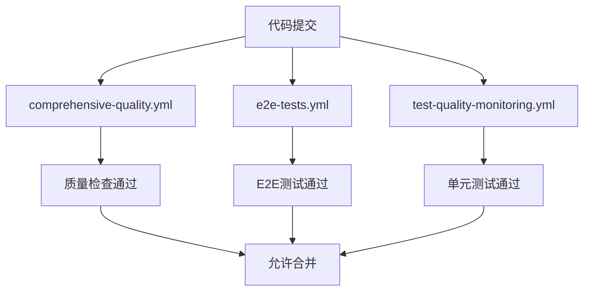

# E2E测试CI/CD集成指南

## 📋 概述

本指南介绍了如何在项目的GitHub Actions CI/CD流程中集成Playwright E2E测试的自动化执行。

## 🚀 新增的工作流文件

### 1. 完整版E2E测试工作流 (`e2e-tests.yml`)

**特性**：
- ✅ 多浏览器测试矩阵 (Chromium, Firefox, WebKit)
- ✅ 智能缓存机制 (依赖和浏览器缓存)
- ✅ 详细的测试报告和摘要
- ✅ 支持手动触发和参数配置
- ✅ 测试结果上传到GitHub Pages

**触发条件**：
- Pull Request到main或develop分支
- 推送到main分支
- 手动触发 (workflow_dispatch)

**执行时间**：约15-25分钟

### 2. 简化版E2E测试工作流 (`e2e-tests-simple.yml`)

**特性**：
- ✅ 仅Chromium浏览器测试
- ✅ 快速执行，适合频繁CI检查
- ✅ 基本的测试报告和状态检查
- ✅ 轻量级配置，易于维护

**触发条件**：
- Pull Request到main或develop分支
- 推送到main分支

**执行时间**：约8-12分钟

## ⚙️ 配置说明

### 环境变量

工作流使用以下环境变量：

```yaml
env:
  NODE_ENV: test
  CI: true
  PLAYWRIGHT_BASE_URL: http://localhost:3000
  PLAYWRIGHT_TEST: true
```

### 缓存策略

**依赖缓存**：
- pnpm store缓存，基于`pnpm-lock.yaml`哈希
- 加速依赖安装过程

**浏览器缓存**：
- Playwright浏览器二进制文件缓存
- 避免重复下载大型浏览器文件

### 超时配置

- **工作流超时**：30分钟 (完整版) / 20分钟 (简化版)
- **测试超时**：继承`playwright.config.ts`配置 (30秒)
- **期望超时**：继承`playwright.config.ts`配置 (5秒)

## 🔧 使用方法

### 自动触发

工作流会在以下情况自动运行：

1. **Pull Request**：
   ```bash
   git checkout -b feature/new-feature
   git add .
   git commit -m "feat: add new feature"
   git push origin feature/new-feature
   # 创建PR时自动触发E2E测试
   ```

2. **推送到主分支**：
   ```bash
   git checkout main
   git merge feature/new-feature
   git push origin main
   # 推送时自动触发E2E测试
   ```

### 手动触发

在GitHub Actions页面可以手动触发完整版工作流：

1. 进入项目的Actions页面
2. 选择"E2E Tests"工作流
3. 点击"Run workflow"
4. 选择参数：
   - **Browser**: all, chromium, firefox, webkit
   - **Headed**: 是否在有头模式下运行

### 本地测试

在提交前本地验证E2E测试：

```bash
# 运行所有E2E测试
pnpm test:e2e

# 运行特定浏览器测试
pnpm test:e2e --project=chromium

# 运行有头模式测试
pnpm test:e2e:headed

# 查看测试报告
pnpm test:e2e:report
```

## 📊 测试报告

### GitHub Actions摘要

每次运行后，工作流会在GitHub Actions页面生成详细的测试摘要：

- 📊 测试统计 (总数、通过、失败)
- 🎯 总体结果状态
- 📋 测试报告下载链接

### Artifacts下载

测试完成后可下载以下文件：

- `playwright-report/` - HTML测试报告
- `playwright-results.json` - JSON格式结果
- `playwright-results.xml` - JUnit格式结果
- `test-results/` - 截图、视频、追踪文件

### GitHub Pages报告 (仅完整版)

主分支的测试报告会自动发布到GitHub Pages：
- URL: `https://[username].github.io/[repo]/e2e-reports/[run-number]/`

## 🚨 故障排除

### 常见问题

#### 1. 测试超时
```yaml
# 解决方案：增加超时时间
timeout-minutes: 30  # 从20增加到30
```

#### 2. 浏览器安装失败
```bash
# 手动安装浏览器依赖
pnpm playwright install-deps
```

#### 3. 端口冲突
```yaml
# 确保使用正确的端口
env:
  PLAYWRIGHT_BASE_URL: http://localhost:3000
```

#### 4. 内存不足
```yaml
# 减少并发数
workers: process.env.CI ? 1 : 4
```

### 调试步骤

1. **检查工作流日志**：
   - 进入Actions页面查看详细日志
   - 重点关注"运行E2E测试"步骤

2. **下载测试报告**：
   - 下载Artifacts中的测试报告
   - 查看失败测试的截图和视频

3. **本地复现**：
   ```bash
   # 使用相同的环境变量
   NODE_ENV=test CI=true pnpm test:e2e
   ```

## 🔄 集成现有工作流

### 依赖关系

新的E2E测试工作流与现有工作流的关系：



### 分支保护规则

建议在GitHub设置中配置分支保护规则：

1. 进入Settings > Branches
2. 添加规则for `main`分支
3. 启用"Require status checks to pass"
4. 选择以下检查：
   - `E2E Tests`
   - `comprehensive-quality`
   - `test-quality-monitoring`

## 📈 性能优化

### 缓存优化

- ✅ pnpm依赖缓存 (节省2-3分钟)
- ✅ Playwright浏览器缓存 (节省3-5分钟)
- ✅ 智能路径触发 (避免不必要的运行)

### 并行执行

- ✅ 多浏览器并行测试
- ✅ 测试文件并行执行
- ✅ CI环境优化配置

### 资源使用

- **CPU**: 2核心 (GitHub Actions标准)
- **内存**: 7GB (GitHub Actions标准)
- **存储**: 14GB SSD (GitHub Actions标准)

## 🎯 最佳实践

1. **测试稳定性**：
   - 使用`retry: 2`配置自动重试
   - 添加适当的等待和断言
   - 避免硬编码的时间延迟

2. **测试覆盖**：
   - 专注于关键用户流程
   - 包含跨浏览器兼容性测试
   - 覆盖响应式设计验证

3. **维护性**：
   - 保持测试代码简洁
   - 使用Page Object模式
   - 定期更新测试数据

4. **监控**：
   - 关注测试执行时间趋势
   - 监控失败率和稳定性
   - 及时修复不稳定的测试

## 🔗 相关文档

- [Playwright配置文档](../testing/playwright-config.md)
- [测试框架详细配置](../测试框架详细配置.md)
- [GitHub Actions工作流指南](./github-actions-guide.md)
