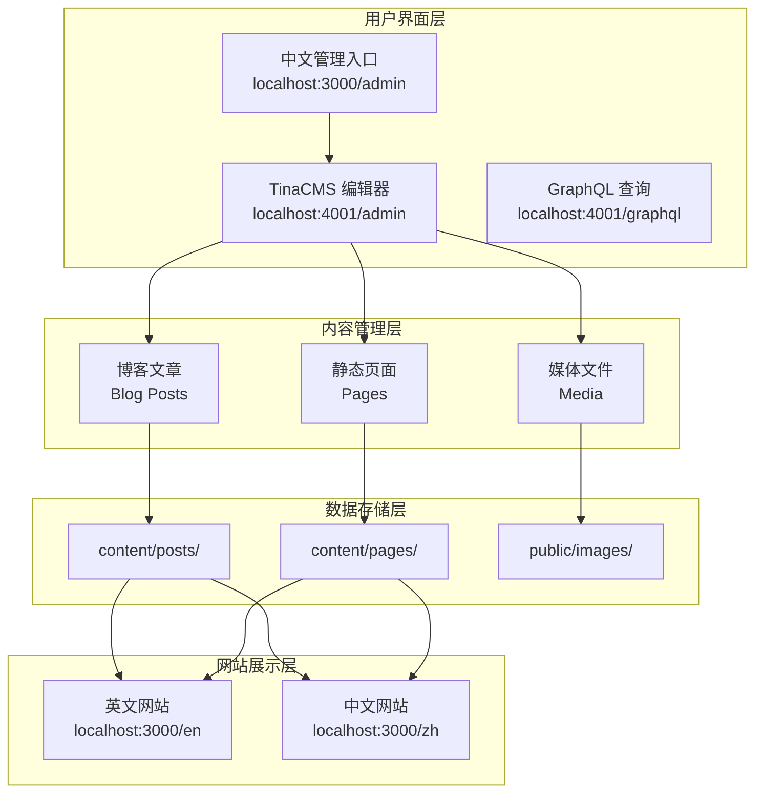
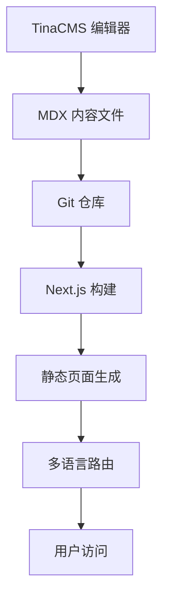

# TinaCMS 操作指南

> **Tucsenberg Web Frontier 项目内容管理系统完整使用指南**
>
> 本指南将帮助您快速掌握 TinaCMS 的使用方法，包括内容创作、多语言管理、媒体处理等核心功能。

## 📋 目录

1. [🎯 TinaCMS 系统概述](#tinacms-系统概述)
2. [🚪 访问入口和界面说明](#访问入口和界面说明)
3. [⚡ 具体操作流程](#具体操作流程)
4. [📝 实际操作示例](#实际操作示例)
5. [📁 内容结构说明](#内容结构说明)
6. [❓ 常见问题和解决方案](#常见问题和解决方案)
7. [💡 最佳实践建议](#最佳实践建议)
8. [🔧 高级功能](#高级功能)
9. [📚 快速参考](#快速参考)

## 🎯 系统架构概览



---

## TinaCMS 系统概述

### 在 Tucsenberg Web Frontier 项目中的作用

TinaCMS 是我们项目的**无头内容管理系统**，专门为现代 JAMstack 架构设计。它在我们的项目中扮演以下关键角色：

- **内容创作平台** - 为非技术用户提供友好的内容编辑界面
- **多语言内容管理** - 统一管理中文和英文内容
- **Git 集成** - 所有内容变更自动提交到版本控制系统
- **类型安全保障** - 通过 TypeScript 确保内容数据的完整性

### 与 Next.js 15 App Router 的集成



**集成特点**：
- **实时预览** - 编辑内容时可以实时查看网站效果
- **自动路由生成** - 基于内容自动生成多语言路由
- **类型安全** - TinaCMS Schema 与 TypeScript 类型系统集成
- **性能优化** - 支持 SSG/ISR，确保最佳加载性能

---

## 访问入口和界面说明

### 1. 中文化管理入口 - `localhost:3000/admin`

**功能特点**：
- 🇨🇳 **完全中文界面** - 为中文用户优化的管理入口
- 📊 **系统状态监控** - 显示 TinaCMS 配置状态和服务运行情况
- 🔗 **快速访问链接** - 一键跳转到各个管理界面
- ⚠️ **重要提示** - 说明 TinaCMS 原生界面的语言限制

**使用场景**：
- 首次访问时的系统状态检查
- 快速导航到不同的管理功能
- 了解系统配置和服务状态

### 2. TinaCMS 原生管理界面 - `localhost:4001/admin/index.html`

**功能特点**：
- 📝 **内容编辑器** - 所见即所得的内容编辑体验
- 🌐 **多语言内容管理** - 在英文界面中管理中英文内容
- 📁 **文件管理** - 浏览和管理内容文件结构
- 🖼️ **媒体管理** - 上传和管理图片、文档等媒体文件

**界面语言说明**：
> ⚠️ **重要提示**：TinaCMS 原生管理界面目前仅支持英文，这是 TinaCMS 的技术限制。但您可以在英文界面中正常编辑和管理中文内容。

### 3. GraphQL 查询界面 - `localhost:4001/graphql`

**功能特点**：
- 🔍 **数据查询** - 使用 GraphQL 查询内容数据
- 📋 **Schema 浏览** - 查看完整的数据结构定义
- 🧪 **API 测试** - 测试和调试 GraphQL 查询
- 📖 **文档查看** - 自动生成的 API 文档

---

## 具体操作流程

### 创建新的博客文章

#### 步骤 1：访问 TinaCMS 管理界面
1. 打开浏览器，访问 `localhost:3000/admin`
2. 确认看到绿色的 **"TinaCMS is Configured!"** 状态提示
3. 点击 **"打开 TinaCMS 管理界面"** 按钮
4. 等待 TinaCMS 加载完成，看到 "Welcome to Tina!" 欢迎界面

#### 步骤 2：选择内容集合
1. 在左侧边栏中找到 **"Blog Posts"** 集合
2. 点击 **"Blog Posts"** 展开文章列表
3. 点击 **"+ New Blog Posts"** 创建新文章
4. 系统会自动创建一个新的文档编辑界面

#### 步骤 2.1：界面导航说明
```
TinaCMS 界面布局：
┌─────────────────────────────────────────────────────────┐
│ [≡] TinaCMS Logo              [Local Mode] [×]          │
├─────────────────────────────────────────────────────────┤
│ 左侧边栏：                    │ 主编辑区域：              │
│ • Collections                │ • 字段编辑表单            │
│   - Blog Posts              │ • 内容预览               │
│   - Pages                   │ • 保存/发布按钮           │
│ • Media                     │                          │
│ • Settings                  │                          │
└─────────────────────────────────────────────────────────┘
```

#### 步骤 3：配置基本信息
```yaml
必填字段：
  - Language: 选择 "English" 或 "中文"
  - Title: 文章标题
  - Description: 文章描述
  - Slug: URL 友好的文章标识符
  - Published Date: 发布日期
  - Author: 作者姓名

可选字段：
  - Updated Date: 更新日期
  - Tags: 文章标签（多个）
  - Categories: 文章分类（多个）
  - Featured: 是否为推荐文章
  - Draft: 是否为草稿
  - Cover Image: 封面图片
```

#### 步骤 4：编辑内容
1. 滚动到页面底部找到 **"Content"** 区域
2. 点击内容编辑器开始编写文章正文
3. 使用富文本编辑器的功能：

**基础格式化**：
- **标题** - 使用 H1-H6 标题层级
- **段落** - 普通文本段落，支持换行
- **粗体/斜体** - 文本强调格式
- **列表** - 有序列表 (1,2,3) 和无序列表 (•)

**高级功能**：
- **链接** - 内部链接 (`/zh/about`) 和外部链接
- **图片** - 点击图片图标上传或选择现有图片
- **代码块** - 支持语法高亮的代码示例
- **引用块** - 重要信息提示和警告

**特殊组件**：
- **CodeBlock** - 代码块组件，支持多种编程语言
- **Callout** - 提示框组件，支持 info/warning/error/success 类型

#### 步骤 4.1：使用代码块组件
1. 在内容编辑器中点击 **"+"** 按钮
2. 选择 **"CodeBlock"** 组件
3. 配置代码块：
   - **Language** - 选择编程语言（typescript, javascript, jsx, tsx, css, html, bash, json）
   - **Code** - 粘贴或输入代码内容

#### 步骤 4.2：使用提示框组件
1. 点击 **"+"** 按钮选择 **"Callout"** 组件
2. 配置提示框：
   - **Type** - 选择类型（info, warning, error, success）
   - **Title** - 提示框标题
   - **Content** - 提示框内容（支持富文本）

#### 步骤 5：配置 SEO 设置
1. 展开 **"SEO Settings"** 部分
2. 填写以下字段：
   - **SEO Title** - 搜索引擎显示的标题
   - **SEO Description** - 搜索引擎描述
   - **SEO Keywords** - 关键词列表
   - **Open Graph Image** - 社交媒体分享图片

#### 步骤 6：保存和发布
1. 点击右上角的 **"Save"** 按钮
2. 如果是草稿，将 **"Draft"** 设置为 `false`
3. 内容将自动提交到 Git 仓库
4. 网站将自动重新构建和部署

### 编辑现有页面内容

#### 步骤 1：找到目标页面
1. 在 TinaCMS 管理界面中选择 **"Pages"** 集合
2. 浏览页面列表，找到要编辑的页面
3. 点击页面名称进入编辑模式

#### 步骤 2：修改内容
1. 直接在编辑器中修改文本内容
2. 更新 **"Updated Date"** 字段
3. 如需要，更新 **"Last Reviewed"** 字段

#### 步骤 3：预览和保存
1. 使用预览功能查看修改效果
2. 确认无误后点击 **"Save"** 保存

### 管理媒体文件

#### 上传新图片
1. **方法一：通过图片字段上传**
   - 在编辑内容时，找到图片字段（如 Cover Image）
   - 点击图片字段的 **"+"** 或 **"Choose Image"** 按钮
   - 选择 **"Upload"** 标签页
   - 拖拽图片文件或点击选择文件
   - 图片将自动保存到 `public/images/` 目录

2. **方法二：通过媒体管理器**
   - 在左侧边栏点击 **"Media"**
   - 点击 **"Upload"** 按钮
   - 选择要上传的文件
   - 支持批量上传多个文件

#### 图片使用建议
```yaml
推荐规格：
  - 格式：JPG, PNG, WebP
  - 大小：< 5MB
  - 分辨率：
    - 封面图：1200x630px (社交媒体分享)
    - 内容图：最大宽度 1920px
    - 缩略图：400x300px

命名规范：
  - 使用英文和数字
  - 用连字符分隔单词
  - 示例：blog-cover-image.jpg
```

#### 管理现有媒体
1. 在媒体选择器中浏览现有文件
2. 点击文件可以查看详细信息
3. 支持的操作：
   - **重命名** - 修改文件名
   - **删除** - 移除不需要的文件
   - **替换** - 上传新版本替换现有文件
4. 所有变更会自动同步到文件系统

#### 媒体文件组织结构
```
public/images/
├── blog/              # 博客相关图片
│   ├── covers/       # 封面图片
│   ├── content/      # 文章内容图片
│   └── thumbnails/   # 缩略图
├── pages/             # 页面图片
├── og/                # Open Graph 图片
└── uploads/           # 用户上传的图片
```

### 语言切换操作

#### 在内容间切换语言
1. 在编辑任何内容时，找到顶部的 **"Language"** 字段
2. 使用下拉菜单选择 "English" 或 "中文"
3. 保存后，内容将保存到对应的语言目录：
   - English → `content/posts/en/` 或 `content/pages/en/`
   - 中文 → `content/posts/zh/` 或 `content/pages/zh/`

#### 创建对应语言版本
1. **复制现有内容**：
   - 先完成英文版本的编辑
   - 点击 **"+ New Blog Posts"** 创建新文档
   - 在 **"Language"** 字段选择 "中文"

2. **保持结构一致**：
   - 使用相同的 `slug`（如：`welcome-to-tucsenberg`）
   - 复制相同的标签和分类
   - 翻译所有文本内容

3. **文件路径示例**：
   ```
   英文版本：content/posts/en/welcome-to-tucsenberg.mdx
   中文版本：content/posts/zh/welcome-to-tucsenberg.mdx
   ```

#### 语言版本关联检查
- ✅ **URL 结构一致** - `/en/blog/slug` 和 `/zh/blog/slug`
- ✅ **SEO 设置完整** - 两种语言都配置了 SEO 字段
- ✅ **发布状态同步** - 确保两个版本的 draft 状态一致
- ✅ **媒体文件共享** - 可以使用相同的图片资源

### 预览和发布内容

#### 实时预览功能
1. **编辑时预览**：
   - 在 TinaCMS 编辑器中，右侧会显示内容预览
   - 修改会实时反映在预览中
   - 支持响应式预览（桌面/平板/手机）

2. **网站预览**：
   - 保存内容后，访问对应的网站页面
   - 英文内容：`localhost:3000/en/blog/[slug]`
   - 中文内容：`localhost:3000/zh/blog/[slug]`

#### 发布流程
1. **草稿模式** (Draft = true)：
   - 内容不会在网站上显示
   - 可以安全地进行编辑和测试
   - 适合内容创作和审核阶段

2. **发布模式** (Draft = false)：
   - 将 **"Draft"** 字段设置为 `false`
   - 点击 **"Save"** 保存
   - 内容会立即在网站上可见
   - 自动触发网站重新构建

3. **发布检查清单**：
   - [ ] 所有必填字段已填写
   - [ ] SEO 设置已配置
   - [ ] 图片已上传并正确引用
   - [ ] 内容格式正确无误
   - [ ] Draft 状态已设置为 false

---

## 实际操作示例

### 示例：创建一篇技术博客文章

#### 场景描述
我们要创建一篇关于 "Next.js 15 新特性" 的技术博客文章，包含中英文两个版本。

#### 英文版本创建步骤

1. **基本信息配置**：
   ```yaml
   Language: English
   Title: "Next.js 15 New Features and Improvements"
   Description: "Explore the latest features in Next.js 15 including improved App Router, enhanced performance, and new developer tools."
   Slug: "nextjs-15-new-features"
   Published Date: "2025-08-09"
   Author: "Tucsenberg Tech Team"
   ```

2. **分类和标签**：
   ```yaml
   Tags: ["Next.js", "React", "Web Development", "Frontend"]
   Categories: ["Technology", "Tutorial"]
   Featured: true
   Draft: false
   ```

3. **SEO 配置**：
   ```yaml
   SEO Title: "Next.js 15 New Features - Complete Guide | Tucsenberg"
   SEO Description: "Comprehensive guide to Next.js 15 new features, performance improvements, and migration tips for modern web development."
   SEO Keywords: ["Next.js 15", "React 19", "App Router", "Web Performance"]
   ```

4. **内容编写**：
   ```markdown
   # Next.js 15: Revolutionary Updates for Modern Web Development

   Next.js 15 brings significant improvements to the React ecosystem...

   ## Key Features

   ### 1. Enhanced App Router
   The new App Router provides...

   ### 2. Performance Improvements
   React 19 integration offers...
   ```

#### 中文版本创建步骤

1. **创建新文档**，选择语言为 "中文"
2. **使用相同的 slug**：`nextjs-15-new-features`
3. **翻译所有内容**：
   ```yaml
   Title: "Next.js 15 新特性和改进"
   Description: "探索 Next.js 15 的最新功能，包括改进的 App Router、性能增强和新的开发工具。"
   Tags: ["Next.js", "React", "Web开发", "前端"]
   Categories: ["技术", "教程"]
   ```

4. **内容翻译**：
   ```markdown
   # Next.js 15：现代 Web 开发的革命性更新

   Next.js 15 为 React 生态系统带来了重大改进...

   ## 主要特性

   ### 1. 增强的 App Router
   新的 App Router 提供了...

   ### 2. 性能改进
   React 19 集成提供了...
   ```

---

## 内容结构说明

### 目录组织结构

```
content/
├── posts/                 # 博客文章
│   ├── en/                # 英文文章
│   │   └── *.mdx         # 英文 MDX 文件
│   └── zh/                # 中文文章
│       └── *.mdx         # 中文 MDX 文件
├── pages/                 # 静态页面
│   ├── en/                # 英文页面
│   │   └── *.mdx         # 英文页面文件
│   └── zh/                # 中文页面
│       └── *.mdx         # 中文页面文件
└── config/                # 配置文件
    └── content.json      # 内容配置
```

### Front Matter 字段说明

#### 博客文章字段 (Blog Posts)

| 字段名 | 类型 | 必填 | 说明 |
|--------|------|------|------|
| `locale` | string | ✅ | 语言标识 (`en` 或 `zh`) |
| `title` | string | ✅ | 文章标题 |
| `description` | string | ✅ | 文章描述 |
| `slug` | string | ✅ | URL 标识符 |
| `publishedAt` | datetime | ✅ | 发布日期 |
| `author` | string | ✅ | 作者姓名 |
| `updatedAt` | datetime | ❌ | 更新日期 |
| `tags` | array | ❌ | 标签列表 |
| `categories` | array | ❌ | 分类列表 |
| `featured` | boolean | ❌ | 是否推荐 |
| `draft` | boolean | ❌ | 是否为草稿 |
| `excerpt` | string | ❌ | 文章摘要 |
| `readingTime` | number | ❌ | 预计阅读时间（分钟） |
| `coverImage` | string | ❌ | 封面图片路径 |

#### 页面字段 (Pages)

| 字段名 | 类型 | 必填 | 说明 |
|--------|------|------|------|
| `locale` | string | ✅ | 语言标识 |
| `title` | string | ✅ | 页面标题 |
| `description` | string | ✅ | 页面描述 |
| `slug` | string | ✅ | URL 标识符 |
| `author` | string | ✅ | 作者姓名 |
| `layout` | string | ❌ | 布局模板 (`default`, `wide`, `narrow`) |
| `showToc` | boolean | ❌ | 是否显示目录 |
| `draft` | boolean | ❌ | 是否为草稿 |
| `publishedAt` | datetime | ❌ | 发布日期 |
| `lastReviewed` | datetime | ❌ | 最后审核日期 |

#### SEO 设置字段

| 字段名 | 类型 | 说明 |
|--------|------|------|
| `seo.title` | string | SEO 标题（覆盖默认标题） |
| `seo.description` | string | 搜索引擎描述 |
| `seo.keywords` | array | SEO 关键词列表 |
| `seo.ogImage` | string | 社交媒体分享图片 |

---

## 常见问题和解决方案

### Q1: 为什么 TinaCMS 管理界面是英文的？

**答案**：这是 TinaCMS 的技术限制。TinaCMS 是开源项目，其管理界面目前仅支持英文。

**解决方案**：
- 使用我们的中文化入口页面 (`localhost:3000/admin`) 获得中文指导
- 在英文管理界面中正常编辑中文内容
- 参考本指南中的字段说明和操作步骤

### Q2: 如何确保中英文内容同步？

**最佳实践**：
1. 先创建英文版本内容
2. 复制相同的结构创建中文版本
3. 确保两个版本使用相同的 `slug`
4. 保持 Front Matter 字段的一致性

### Q3: 内容保存后多久生效？

**时间线**：
- **本地开发** - 立即生效（热重载）
- **生产环境** - 2-5 分钟（构建和部署时间）

### Q4: 如何处理图片上传失败？

**排查步骤**：
1. 检查图片大小（建议 < 5MB）
2. 确认图片格式（支持 JPG, PNG, WebP）
3. 检查 `public/images/` 目录权限
4. 重启开发服务器

### Q5: 内容编辑时出现冲突怎么办？

**解决方案**：
1. 保存当前编辑内容的备份
2. 刷新页面获取最新版本
3. 重新应用您的修改
4. 建议团队协作时使用分支工作流

### Q6: 如何批量管理内容？

**GraphQL 查询方式**：
1. 访问 `localhost:4001/graphql`
2. 使用以下查询获取所有文章：
   ```graphql
   query {
     postsConnection {
       edges {
         node {
           _sys {
             filename
             relativePath
           }
           title
           locale
           publishedAt
         }
       }
     }
   }
   ```

### Q7: 如何备份和恢复内容？

**备份方法**：
- 所有内容存储在 `content/` 目录中
- 使用 Git 进行版本控制和备份
- 定期推送到远程仓库

**恢复方法**：
- 使用 `git checkout` 恢复特定版本
- 从 Git 历史中恢复删除的文件
- TinaCMS 会自动检测文件变更并更新界面

### Q8: 性能优化建议

**内容优化**：
- 图片压缩：使用 WebP 格式
- 内容长度：单篇文章建议 < 5000 字
- 标签数量：每篇文章 < 10 个标签
- 分类数量：每篇文章 < 5 个分类

**系统优化**：
- 定期清理未使用的媒体文件
- 避免创建过多的草稿文章
- 使用合适的图片尺寸和格式

---

## 最佳实践建议

### 内容编辑工作流程

#### 1. 准备阶段
- [ ] 确认开发服务器正在运行 (`pnpm run tina:dev`)
- [ ] 检查 TinaCMS 配置状态 (`localhost:3000/admin`)
- [ ] 准备好要使用的图片和媒体文件

#### 2. 内容创作阶段
- [ ] 先创建英文版本（作为主版本）
- [ ] 填写完整的 Front Matter 信息
- [ ] 使用结构化的内容组织（标题、段落、列表）
- [ ] 添加适当的标签和分类
- [ ] 配置 SEO 设置

#### 3. 多语言管理
- [ ] 基于英文版本创建中文版本
- [ ] 保持相同的 `slug` 和文件结构
- [ ] 翻译所有文本内容，包括 SEO 字段
- [ ] 确保图片路径和媒体引用一致

#### 4. 质量检查
- [ ] 预览内容在网站上的显示效果
- [ ] 检查多语言链接是否正确
- [ ] 验证 SEO 设置是否完整
- [ ] 确认移动端显示效果

#### 5. 发布流程
- [ ] 将 `draft` 设置为 `false`
- [ ] 设置正确的发布日期
- [ ] 保存并等待自动部署
- [ ] 验证线上效果

### 多语言内容管理最佳实践

#### 内容一致性原则
1. **结构一致** - 中英文版本保持相同的章节结构
2. **字段完整** - 所有必填字段在两种语言中都要填写
3. **媒体共享** - 尽可能使用相同的图片和媒体文件
4. **SEO 优化** - 为每种语言配置适当的 SEO 设置

#### 文件命名规范
```
正确示例：
content/posts/en/welcome-to-tucsenberg.mdx
content/posts/zh/welcome-to-tucsenberg.mdx

错误示例：
content/posts/en/welcome.mdx
content/posts/zh/欢迎.mdx  # 避免使用中文文件名
```

### 版本控制和协作注意事项

#### Git 工作流集成
- **自动提交** - TinaCMS 会自动将内容变更提交到 Git
- **提交信息** - 使用描述性的提交信息
- **分支策略** - 建议使用功能分支进行大型内容更新
- **冲突解决** - 多人协作时注意避免同时编辑同一文件

#### 团队协作建议
1. **分工明确** - 指定专人负责特定语言或内容类型
2. **定期同步** - 定期检查和同步中英文内容
3. **审核流程** - 建立内容审核和发布流程
4. **备份策略** - 定期备份重要内容

---

## 技术支持

### 开发服务器命令

```bash
# 启动 TinaCMS 开发服务器
pnpm run tina:dev

# 启动 Next.js 开发服务器
pnpm run dev

# 同时启动两个服务器
pnpm run dev:full
```

### 故障排除命令

```bash
# 检查 TinaCMS 配置
pnpm run tina:audit

# 重新生成 TinaCMS 类型
pnpm run tina:build

# 清理缓存并重启
rm -rf .next && pnpm run dev
```

### 联系支持

如果遇到技术问题，请：
1. 查看控制台错误信息
2. 检查网络连接和服务器状态
3. 参考 [TinaCMS 官方文档](https://tina.io/docs/)
4. 联系开发团队获取技术支持

---

## 快速参考

### 常用访问链接

| 功能 | 链接 | 说明 |
|------|------|------|
| 中文管理入口 | `localhost:3000/admin` | 中文化的系统状态和导航页面 |
| TinaCMS 管理 | `localhost:4001/admin/index.html` | 原生内容编辑界面 |
| GraphQL 查询 | `localhost:4001/graphql` | API 查询和测试界面 |
| 英文网站 | `localhost:3000/en` | 英文版本网站预览 |
| 中文网站 | `localhost:3000/zh` | 中文版本网站预览 |

### 快速操作指令

```bash
# 启动完整开发环境
pnpm run tina:dev

# 仅启动 Next.js
pnpm run dev

# 检查 TinaCMS 配置
pnpm run tina:audit

# 重新生成类型定义
pnpm run tina:build

# 查看所有可用命令
pnpm run
```

### 内容字段快速参考

#### 博客文章必填字段
- `locale` - 语言选择
- `title` - 文章标题
- `description` - 文章描述
- `slug` - URL 标识符
- `publishedAt` - 发布日期
- `author` - 作者姓名

#### 页面必填字段
- `locale` - 语言选择
- `title` - 页面标题
- `description` - 页面描述
- `slug` - URL 标识符
- `author` - 作者姓名

### 故障排除快速检查

#### 服务器无法启动
```bash
# 检查端口占用
lsof -i :3000
lsof -i :4001

# 清理并重启
rm -rf .next
rm -rf node_modules/.cache
pnpm install
pnpm run tina:dev
```

#### 内容不显示
1. 检查 `draft` 字段是否为 `false`
2. 确认文件保存在正确的语言目录
3. 验证 Front Matter 格式是否正确
4. 检查控制台是否有错误信息

#### 图片无法加载
1. 确认图片保存在 `public/images/` 目录
2. 检查图片路径是否以 `/images/` 开头
3. 验证图片格式是否支持（JPG, PNG, WebP）
4. 确认图片大小 < 5MB

---

## 高级功能

### 自定义组件使用

#### CodeBlock 组件
```markdown
在 TinaCMS 中插入代码块：
1. 点击内容编辑器的 "+" 按钮
2. 选择 "CodeBlock" 组件
3. 配置语言和代码内容
4. 支持语法高亮和复制功能
```

#### Callout 组件
```markdown
创建提示框：
1. 选择 "Callout" 组件
2. 选择类型：info（蓝色）、warning（黄色）、error（红色）、success（绿色）
3. 添加标题和内容
4. 支持富文本格式
```

### 批量操作技巧

#### 使用 GraphQL 查询数据
```graphql
# 获取所有草稿文章
query {
  postsConnection(filter: { draft: { eq: true } }) {
    edges {
      node {
        title
        locale
        _sys {
          relativePath
        }
      }
    }
  }
}

# 获取特定分类的文章
query {
  postsConnection(filter: { categories: { in: ["Technology"] } }) {
    edges {
      node {
        title
        categories
        publishedAt
      }
    }
  }
}
```

#### 内容迁移和导入
1. **从其他 CMS 迁移**：
   - 导出现有内容为 Markdown 格式
   - 调整 Front Matter 字段匹配我们的 Schema
   - 批量放置到对应的语言目录

2. **批量创建内容**：
   - 使用脚本生成 MDX 文件
   - 确保 Front Matter 格式正确
   - TinaCMS 会自动检测新文件

---

## 安全和权限管理

### 本地开发环境
- 默认无需认证，所有功能可用
- 适合内容创作和测试

### 生产环境配置
- 需要配置 TinaCloud 认证
- 支持团队协作和权限管理
- 内容变更需要审核流程

### 数据安全
- 所有内容存储在 Git 仓库中
- 支持版本控制和回滚
- 定期备份到远程仓库

---

*最后更新：2025年8月9日*
*文档版本：v1.0*
*维护者：Tucsenberg 开发团队*
